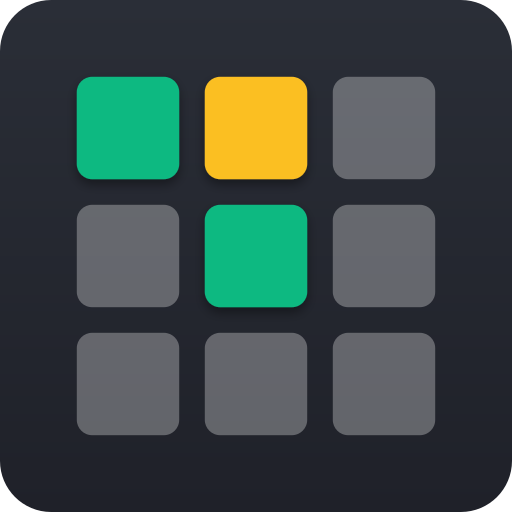

<p align="center">
   <a href="https://play.ronbodnar.com" target="_blank">
      
   </a>
</p>

<h1 align="center">Grid of Words</h1>

<p align="center">
  A full-stack, <b>opinionated</b> word puzzle game inspired by Wordle.
</p>

<p align="center">
  Guess the word, track your stats, and play as many times as you like!
</p>

<p align="center">
  
  
  
  
  
  
</p>

<br />

<p align="center">
  <a href="https://play.ronbodnar.com" target="_blank">
    
  </a>
</p>

<a name="getting-started"></a>

## 🚦 Getting Started

### Clone

```
git clone https://github.com/ronbodnar/grid-of-words.git
cd grid-of-words
```

### Run with Docker

```bash
# Build and launch the development container suite
docker-compose -f compose.dev.yaml up --build

# Build and launch the production container suite
docker-compose up --build
```

The stack includes the Node application and a MongoDB instance pre-configured for internal network communication.

<br />

<a name="features"></a>

## 🧠 Technical Features

- **Word Puzzle Logic**: Full Wordle-style gameplay with attempt validation, game state tracking, and abandoned games handling.
- **Backend**: Node.js + Express API with MongoDB for users, games, stats, and words.
- **Authentication**: JWT-based login, registration, and password reset flows.
- **Frontend**: Vanilla JS SPA with dynamic DOM updates for the gameboard and keyboard.
- **Stats & Tracking**: Win distribution and game history per user.
- **DB Seeding**: Scripts and word lists to populate the database on deployment.
- **Logging**: Winston for request and error logging.

<br />

<a name="connect"></a>

## 📫 Connect

**Created by Ron Bodnar**

- LinkedIn: https://linkedin.com/in/ronbodnar
- Email: ron.bodnar@outlook.com

<br />

<a name="license"></a>

## ⚖️ License

Distributed under the MIT License. See LICENSE for more information.
